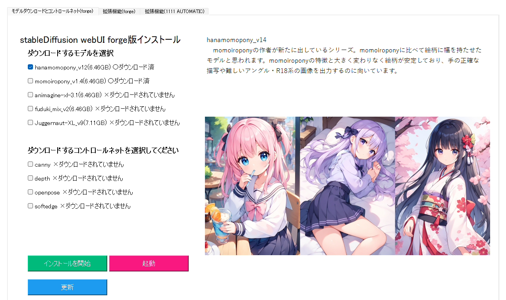

# SDWebUI-full-kit

## これは何ですか？ What is this?

自分のＰＣ上で画像生成AIを実行できるstableDiffusionWebUI forge版を説明付きのアプリで解説を見ながらインストールできるアプリケーションです。

This is an application that allows you to install the stableDiffusionWebUI forge version of the image generation AI on your own PC with explanations in an application with instructions.

これには厳選された生成モデル(checkpoint)、controlnetと呼ばれる画像制御モデル(controlnet checkpoint)、各種の初心者から上級者まで広くお勧めできる拡張機能のインストールが可能です。

It includes the installation of selected generative models (checkpoints), image control models called controlnet (controlnet checkpoints), and various extensions that are widely recommended for beginners and advanced users alike.

## 使い方 How to use
まずはダウンロードを行います。すでにgitがインストールされている人はgit cloneでダウンロードできます。それ以外の人は画像の手順でZIPファイルをダウンロードし、解凍してください。

The first step is to download the file. If you already have git installed, you can download it by git clone. For others, download the ZIP file and unzip it according to the procedure shown in the image.

git cloneまたは解凍するとこのようなフォルダー構成になっています。「01_python_and_git_installer.bat」を起動するとWebUIを実行するのに必要なアプリがダウンロードとインストールされます。(pythonとgit)
途中、gitでインストールを許可するか聞かれますので「はい」とお答えください。そのあとは勝手にインストールが続行されコマンドプロンプト(黒い画面)は終了します。
次に「02_request.bat」を起動してください。こちらはすぐインストールが終わり勝手に閉じます。

When you git clone or unzip the file, you will see a folder structure like this. Run "01_python_and_git_installer.bat" to download and install the apps necessary to run WebUI. (python and git)
On the way, you will be asked if you want to allow installation with git. After that, the installation will continue on its own and the command prompt (black screen) will close.
Next, run "02_request.bat". This one will finish installation immediately and close on its own.

アプリは「03_webui_installer.bat」を起動することで実行されます。
おすすめの画像生成AIモデルや拡張機能を画像付きの説明を見ながらダウンロードできます。

The apps are executed by launching "02_webui_installer.bat".
You can download recommended image-generating AI models and extensions with explanations with images.

各チェックボックスにチェックを入れると画像付きの説明を見ることができます。緑ボタンでインストールを開始することができます。

Check each checkbox to see a description with images. You can start the installation with the green button.

ダウンロードが終わったら完了ポップアップが出ます。次に青のボタンの起動を押すとWebUIを起動できます。初回は起動に時間がかかります。

When the download is finished, a completion popup will appear. Next, you can press the blue button Launch to start WebUI. It will take some time to start up the first time.
